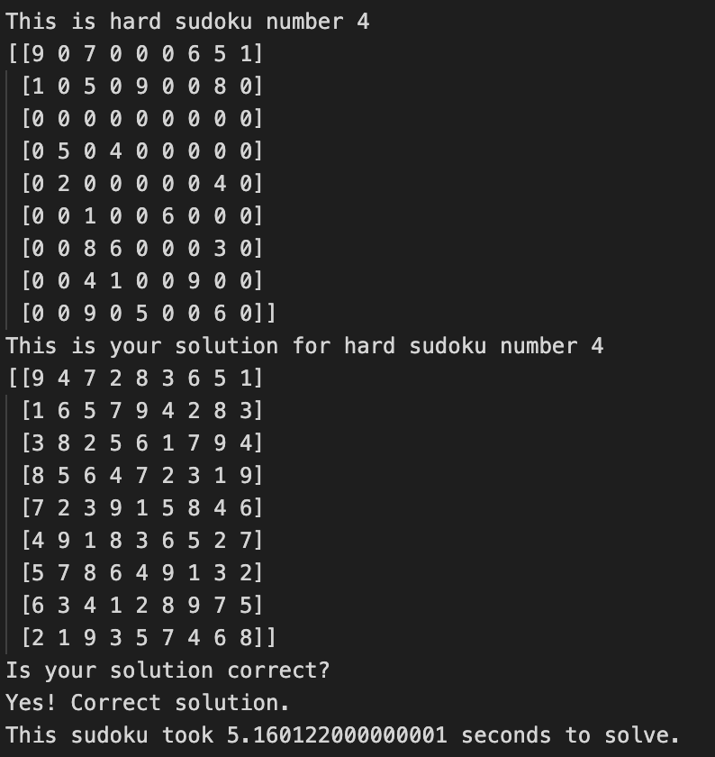

Sudoku Solver

### <u>The Algorithm<u/>
__backtracking depth-first search with constraint satisfaction__ was used for this project. After some reasearch of different search algorithms for tasks such as sudoku solving, I found this to be one of the most commonly used algorithmsand a good introduction to the topic. 

  
### <u>Improvements and different approaches<u/>

* Could make the sudoku solvable for n^2 x n^2 where n is an integer.
* Make avaliable to run on a website
* Make inputting a new sudoku possible
* Write a code to create new sudokus 
